# Maze Explorer (VisualizeSearchAlgorithm)

About more (English ver.): 

## 1. Mục tiêu

Dự án "VisualizeSearchAlgorithm" hay còn gọi là “Maze Explorer” được xây dựng với mục tiêu cung cấp một công cụ trực quan hóa các thuật toán tìm kiếm đường đi trong mê cung. Đây là một ứng dụng kết hợp giữa học thuật và giải trí, nhằm hỗ trợ người dùng, đặc biệt là sinh viên và người học về trí tuệ nhân tạo (AI), hiểu rõ hơn về cách các thuật toán hoạt động trong thực tế. Dự án không chỉ dừng lại ở việc mô phỏng thuật toán mà còn hướng tới việc tạo ra một môi trường tương tác để người dùng trải nghiệm và khám phá.

### 1.1 Giáo dục và hỗ trợ học tập
- Trực quan hóa quy trình hoạt động của các thuật toán tìm kiếm đường đi như A*, BFS, DFS, và nhiều thuật toán khác. Người dùng có thể quan sát cách các thuật toán này mở rộng các nút, chọn đường đi, và tối ưu hóa giải pháp.
- So sánh hiệu suất giữa các thuật toán, bao gồm thời gian thực thi và độ dài đường đi, từ đó cung cấp kiến thức thực tế về ưu và nhược điểm của từng thuật toán trong các tình huống khác nhau.

### 1.2 Tăng tính tương tác và trải nghiệm người dùng
- Cung cấp giao diện hiện đại, dễ sử dụng để người dùng có thể tự tạo và tùy chỉnh mê cung. Các tính năng như thêm tường, điều chỉnh trọng số ô, và thay đổi vị trí điểm bắt đầu và kết thúc mang lại sự linh hoạt cao.
- Hai chế độ hoạt động chính (Visualization Mode và Game Mode) cho phép người dùng vừa học tập, vừa giải trí. Trong chế độ trò chơi, người dùng có thể trực tiếp điều khiển nhân vật để tìm đường trong mê cung với độ khó tăng dần, qua đó nâng cao khả năng tư duy logic.

### 1.3 Ứng dụng thực tế của trí tuệ nhân tạo
- Các thuật toán tìm kiếm và tạo mê cung được trình bày trong dự án là các thành phần quan trọng của AI, thường được ứng dụng trong robot học, lập kế hoạch, và các bài toán tối ưu hóa. Dự án giúp người dùng nhận thức được tiềm năng và ứng dụng rộng rãi của AI trong đời sống thực tế.

### 1.4 Kết hợp giữa học thuật và giải trí
- Bằng cách tích hợp chế độ trò chơi, dự án không chỉ dừng lại ở việc cung cấp kiến thức mà còn tạo ra một môi trường giải trí sáng tạo. Người dùng có thể thử thách bản thân với các mê cung khó hoặc xem cách giải tự động của hệ thống.

## 2. Nội dung

### 2.1 Các thuật toán Tìm kiếm không có thông tin

#### Thành phần chính của bài toán tìm đường
1. **Trạng thái ban đầu (Initial State):**
   - Là vị trí xuất phát trên lưới (grid) được người dùng xác định. Ví dụ: trong các thuật toán BFS, DFS, UCS của repo, trạng thái ban đầu được xác định bằng `grid.start`.
2. **Trạng thái mục tiêu (Goal State):**
   - Là vị trí đích mà bài toán yêu cầu tìm đường đến. Trạng thái này được xác định bằng `grid.end`.
3. **Không gian trạng thái (State Space):**
   - Bao gồm tất cả các trạng thái có thể đạt được trong lưới. Các trạng thái được xác định bởi các vị trí hợp lệ trên lưới (như ô trống hoặc ô không bị chặn).
4. **Tập hợp các hành động (Actions):**
   - Các hành động di chuyển có thể thực hiện trên lưới để chuyển từ trạng thái hiện tại sang trạng thái mới. Trong bài toán tìm đường, các hành động bao gồm:
     - Di chuyển lên.
     - Di chuyển xuống.
     - Di chuyển sang trái.
     - Di chuyển sang phải.
5. **Hàm chuyển đổi (Transition Function):**
   - Hàm xác định trạng thái mới sau khi thực hiện một hành động. Cụ thể:
     - Lấy vị trí hiện tại.
     - Kiểm tra các ô lân cận (trái, phải, trên, dưới) xem có hợp lệ để di chuyển không.
     - Nếu hợp lệ, cập nhật trạng thái mới và thêm vào danh sách các trạng thái chờ xét duyệt.
6. **Hàm chi phí (Cost Function):**
   - Được áp dụng trong thuật toán UCS. Mỗi hành động di chuyển có thể có một chi phí (ví dụ: chi phí bằng 1 cho mỗi bước di chuyển). Tổng chi phí được tính bằng cách cộng dồn các chi phí của các hành động từ trạng thái ban đầu đến trạng thái hiện tại.

#### Thuật toán và cách tiếp cận giải pháp
1. **BFS (Breadth-First Search):**
   - **Cách hoạt động:**
     - Sử dụng hàng đợi FIFO (`Queue Frontier`) để duyệt qua các trạng thái theo chiều rộng.
     - Ưu tiên mở rộng các trạng thái theo thứ tự khoảng cách ngắn nhất từ trạng thái ban đầu.
   - **Ưu điểm:**
     - Tìm được đường đi ngắn nhất nếu chi phí các bước đi là như nhau.
   - **Kết quả trả về:**
     - Đường đi từ trạng thái ban đầu đến trạng thái mục tiêu và danh sách các trạng thái đã duyệt qua.
    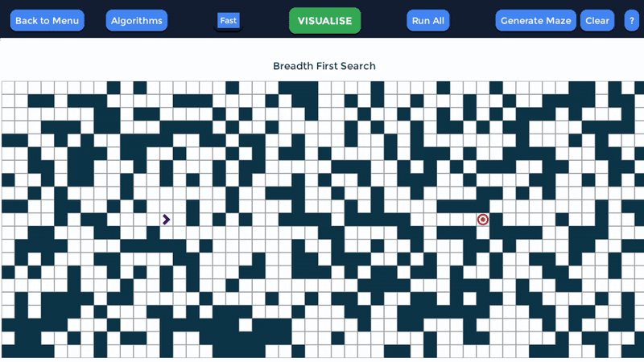
2. **DFS (Depth-First Search):**
   - **Cách hoạt động:**
     - Sử dụng ngăn xếp LIFO (`Stack Frontier`) để duyệt qua trạng thái theo chiều sâu.
     - Đi sâu vào một nhánh trước khi quay lại các nhánh khác.
   - **Ưu điểm:**
     - Tốn ít bộ nhớ hơn BFS.
   - **Nhược điểm:**
     - Không đảm bảo tìm được đường đi ngắn nhất.
   - **Kết quả trả về:**
     - Đường đi từ trạng thái ban đầu đến trạng thái mục tiêu và danh sách các trạng thái đã duyệt qua.
    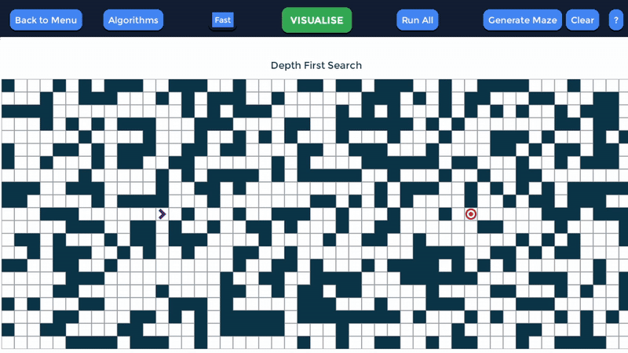
3. **UCS (Uniform-Cost Search):**
   - **Cách hoạt động:**
     - Sử dụng hàng đợi ưu tiên (`Priority Queue Frontier`) để duyệt qua các trạng thái dựa trên chi phí thấp nhất.
     - Mỗi lần mở rộng trạng thái, chọn trạng thái có tổng chi phí thấp nhất để mở rộng tiếp theo.
   - **Ưu điểm:**
     - Đảm bảo tìm được đường đi có chi phí thấp nhất.
   - **Nhược điểm:**
     - Tốn nhiều bộ nhớ và thời gian hơn BFS.
   - **Kết quả trả về:**
     - Đường đi từ trạng thái ban đầu đến trạng thái mục tiêu, danh sách các trạng thái đã duyệt qua, và tổng chi phí.
    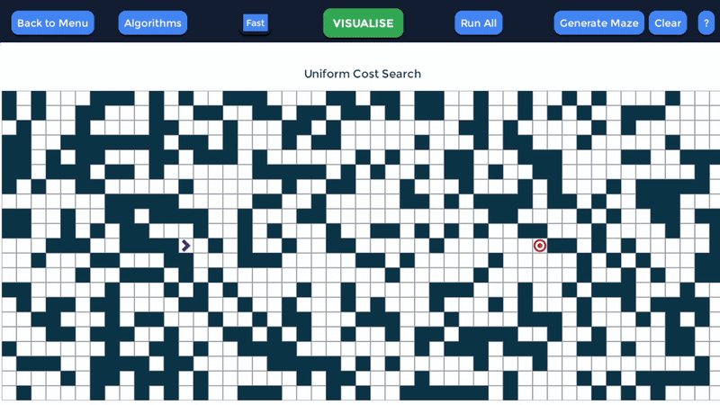

#### Giải pháp (Solution)
- **Định nghĩa:**
  - Giải pháp là đường đi từ trạng thái ban đầu (`grid.start`) đến trạng thái mục tiêu (`grid.end`), được biểu diễn dưới dạng:
    - Một danh sách các trạng thái trên lưới.
    - Các hành động tương ứng để di chuyển giữa các trạng thái.
    - Tổng chi phí (nếu áp dụng chi phí trong bài toán).
- **Kết quả:**
  - Nếu tìm được trạng thái mục tiêu:
    - Trả về danh sách các trạng thái, các hành động, và chi phí (nếu có).
  - Nếu không tìm được trạng thái mục tiêu:
    - Trả về một danh sách rỗng hoặc thông báo không tìm thấy giải pháp.

#### Nhận xét
- **BFS:** Phù hợp cho bài toán yêu cầu tìm đường ngắn nhất nhưng có thể tốn nhiều bộ nhớ.
- **DFS:** Phù hợp cho bài toán nhỏ, không gian trạng thái hạn chế, nhưng không đảm bảo tối ưu.
- **UCS:** Đảm bảo tối ưu về chi phí, nhưng đòi hỏi nhiều tài nguyên hơn BFS.

### 2.2 Các thuật toán Tìm kiếm có thông tin

#### Thành phần chính của bài toán tìm đường
1. **Trạng thái ban đầu (Initial State):**
   - Là vị trí xuất phát trên lưới (grid) do người dùng xác định. Ví dụ: trong các thuật toán A* và GBFS, trạng thái ban đầu được xác định bằng `grid.start`.
2. **Trạng thái mục tiêu (Goal State):**
   - Là vị trí đích mà bài toán yêu cầu tìm đường đến. Trạng thái này được xác định bằng `grid.end`.
3. **Không gian trạng thái (State Space):**
   - Bao gồm tất cả các trạng thái hợp lệ trên lưới, được tạo ra bởi các hành động di chuyển từ trạng thái ban đầu đến trạng thái mục tiêu.
4. **Tập hợp các hành động (Actions):**
   - Các hành động di chuyển có thể thực hiện trên lưới để chuyển từ trạng thái hiện tại sang trạng thái mới. Trong bài toán tìm đường, các hành động bao gồm:
     - Di chuyển lên.
     - Di chuyển xuống.
     - Di chuyển sang trái.
     - Di chuyển sang phải.
5. **Hàm chuyển đổi (Transition Function):**
   - Hàm xác định trạng thái mới sau khi thực hiện một hành động. Cụ thể:
     - Lấy vị trí hiện tại.
     - Kiểm tra các ô lân cận (trái, phải, trên, dưới) xem có hợp lệ để di chuyển không.
     - Nếu hợp lệ, cập nhật trạng thái mới và thêm vào danh sách các trạng thái chờ xét duyệt.
6. **Hàm heuristic:**
   - Hàm đánh giá khoảng cách ước lượng từ trạng thái hiện tại đến trạng thái mục tiêu.
     - A*: Kết hợp cả chi phí thực tế (`g`) và ước lượng (`h`) để tối ưu hóa tìm kiếm.
     - GBFS: Chỉ dựa vào giá trị ước lượng (`h`) để tìm đường nhanh nhất.
7. **Hàm chi phí (Cost Function):**
   - Được áp dụng trong thuật toán A*. Chi phí được tính bằng:
     - `g(n)`: Tổng chi phí từ trạng thái ban đầu đến trạng thái hiện tại.
     - `f(n) = g(n) + h(n)`: Tổng chi phí bao gồm cả chi phí thực tế và chi phí ước lượng.

#### Thuật toán và cách tiếp cận giải pháp
1. **A* Search (AStarSearch):**
   - **Cách hoạt động:**
     - Sử dụng hàng đợi ưu tiên (`PriorityQueueFrontier`) để mở rộng các trạng thái dựa trên giá trị `f(n)`.
     - Mỗi bước, chọn trạng thái có giá trị `f(n)` thấp nhất để mở rộng.
   - **Ưu điểm:**
     - Đảm bảo tìm được đường đi ngắn nhất nếu hàm heuristic là chính xác và phù hợp.
   - **Nhược điểm:**
     - Tốn nhiều bộ nhớ vì lưu trữ toàn bộ các trạng thái đang xét.
   - **Kết quả trả về:**
     - Đường đi từ trạng thái ban đầu đến trạng thái mục tiêu, danh sách các trạng thái đã duyệt qua, và tổng chi phí.
    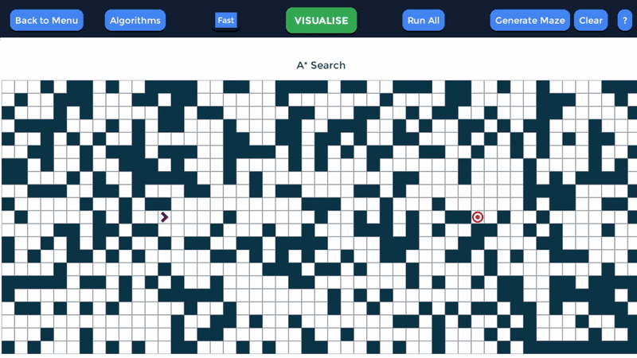
2. **Greedy Best-First Search (GBFS):**
   - **Cách hoạt động:**
     - Sử dụng hàng đợi ưu tiên (`PriorityQueueFrontier`) để mở rộng các trạng thái dựa trên giá trị hàm heuristic `h(n)`.
     - Chỉ tập trung vào trạng thái ước lượng gần nhất với mục tiêu.
   - **Ưu điểm:**
     - Chạy nhanh hơn so với A* vì chỉ phụ thuộc vào giá trị heuristic.
   - **Nhược điểm:**
     - Không đảm bảo tìm được đường đi ngắn nhất.
   - **Kết quả trả về:**
     - Đường đi từ trạng thái ban đầu đến trạng thái mục tiêu và danh sách các trạng thái đã duyệt qua.
    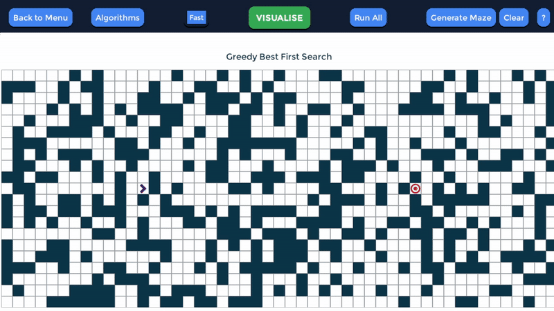

#### Giải pháp (Solution)
- **Định nghĩa:**
  - Giải pháp là đường đi từ trạng thái ban đầu (`grid.start`) đến trạng thái mục tiêu (`grid.end`), được biểu diễn dưới dạng:
    - Một danh sách các trạng thái trên lưới.
    - Các hành động tương ứng để di chuyển giữa các trạng thái.
    - Tổng chi phí (nếu áp dụng chi phí trong bài toán).
- **Kết quả:**
  - Nếu tìm được trạng thái mục tiêu:
    - Trả về danh sách các trạng thái, các hành động, và chi phí (nếu có).
  - Nếu không tìm được trạng thái mục tiêu:
    - Trả về một danh sách rỗng hoặc thông báo không tìm thấy giải pháp.

#### Nhận xét
- **A* Search:**
  - Phù hợp cho bài toán yêu cầu tìm đường ngắn nhất và tối ưu, nhưng yêu cầu bộ nhớ cao.
- **GBFS:**
  - Chạy nhanh hơn, phù hợp với bài toán không cần đảm bảo tối ưu về đường đi.

### 2.3 Các thuật toán Tìm kiếm cục bộ

#### Thành phần chính của bài toán tìm đường
1. **Trạng thái ban đầu (Initial State):**
   - Là vị trí xuất phát trên lưới (`grid.start`) được người dùng xác định. Trong thuật toán Beam Search, trạng thái ban đầu được biểu diễn dưới dạng một node bắt đầu (`start_node`).
2. **Trạng thái mục tiêu (Goal State):**
   - Là vị trí đích được yêu cầu tìm đến, được xác định bằng `grid.end`.
3. **Không gian trạng thái (State Space):**
   - Bao gồm tất cả các trạng thái hợp lệ trên lưới, được tạo ra bởi các hành động di chuyển từ trạng thái ban đầu đến trạng thái mục tiêu.
4. **Tập hợp các hành động (Actions):**
   - Các hành động di chuyển có thể thực hiện trên lưới để chuyển từ trạng thái hiện tại sang trạng thái mới. Trong bài toán tìm đường, các hành động bao gồm:
     - Di chuyển lên.
     - Di chuyển xuống.
     - Di chuyển sang trái.
     - Di chuyển sang phải.
5. **Hàm chuyển đổi (Transition Function):**
   - Hàm xác định trạng thái mới sau khi thực hiện một hành động:
     - Lấy vị trí hiện tại.
     - Kiểm tra các ô lân cận (trái, phải, trên, dưới) xem có hợp lệ để di chuyển không.
     - Nếu hợp lệ, tạo node mới với trạng thái cập nhật và thêm node vào danh sách các trạng thái chờ xét duyệt.
6. **Hàm heuristic:**
   - Hàm đánh giá khoảng cách ước lượng từ trạng thái hiện tại đến trạng thái mục tiêu:
     - Sử dụng khoảng cách Manhattan (`|x1 - x2| + |y1 - y2|`) để tính toán.
7. **Chiến lược Beam Search:**
   - Beam Search giới hạn số lượng trạng thái được mở rộng tại mỗi bước theo `beam_width`:
     - Chỉ giữ lại `beam_width` trạng thái có giá trị heuristic tốt nhất từ danh sách các trạng thái tiềm năng.

#### Thuật toán và cách tiếp cận giải pháp
1. **Beam Search:**
   - **Cách hoạt động:**
     - Sử dụng hàng đợi ưu tiên (`PriorityQueue`) để lưu trữ các trạng thái hiện tại, sắp xếp theo giá trị heuristic.
     - Tại mỗi bước, chỉ giữ lại `beam_width` trạng thái tốt nhất để mở rộng.
     - Nếu trạng thái mục tiêu nằm trong danh sách `frontier`, thuật toán sẽ trả về đường đi.
   - **Ưu điểm:**
     - Giảm đáng kể bộ nhớ và thời gian so với các thuật toán khác bằng cách giới hạn số trạng thái được mở rộng.
   - **Nhược điểm:**
     - Không đảm bảo tìm được lời giải tối ưu.
     - Có thể bỏ qua trạng thái dẫn đến lời giải tốt hơn nếu `beam_width` quá nhỏ.
   - **Kết quả trả về:**
     - Đường đi từ trạng thái ban đầu đến trạng thái mục tiêu, danh sách các trạng thái đã được duyệt, và chi phí đường đi.
    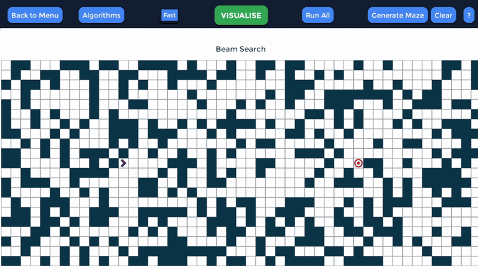

#### Giải pháp (Solution)
- **Định nghĩa:**
  - Giải pháp là đường đi từ trạng thái ban đầu (`grid.start`) đến trạng thái mục tiêu (`grid.end`), được biểu diễn dưới dạng:
    - Một danh sách các trạng thái trên lưới.
    - Các hành động tương ứng để di chuyển giữa các trạng thái.
    - Tổng chi phí (số bước di chuyển).
- **Kết quả:**
  - Nếu tìm được trạng thái mục tiêu:
    - Trả về danh sách các trạng thái, các hành động, và chi phí.
  - Nếu không tìm được trạng thái mục tiêu:
    - Trả về danh sách rỗng hoặc thông báo không tìm thấy giải pháp.

#### Nhận xét
- **Beam Search:**
  - Phù hợp cho các bài toán lớn khi cần giới hạn tài nguyên bộ nhớ.
  - Hiệu quả trong các bài toán không yêu cầu tối ưu tuyệt đối nhưng cần kết quả nhanh chóng.
  - Cần cân nhắc giá trị `beam_width` để đạt được hiệu suất tối ưu mà không bỏ qua lời giải khả thi.

### 2.4 Các thuật toán Tìm kiếm trong môi trường phức tạp

#### Thành phần chính của bài toán tìm đường
1. **Trạng thái ban đầu (Initial State):**
   - Là vị trí xuất phát trên lưới (`grid.start`) được người dùng xác định. Trạng thái này được biểu diễn bằng một nút OR ban đầu (`start_node.is_and = False`).
2. **Trạng thái mục tiêu (Goal State):**
   - Là vị trí đích được yêu cầu tìm đến, được xác định bằng `grid.end`.
3. **Không gian trạng thái (State Space):**
   - Bao gồm tất cả các trạng thái hợp lệ trên lưới, được tạo ra bởi các hành động di chuyển từ trạng thái ban đầu đến trạng thái mục tiêu. Trong thuật toán AND-OR Search, không gian trạng thái được lưu trữ dưới dạng một cây AND-OR (`and_or_tree`).
4. **Tập hợp các hành động (Actions):**
   - Các hành động di chuyển có thể thực hiện trên lưới để chuyển từ trạng thái hiện tại sang trạng thái mới. Các hành động bao gồm:
     - Di chuyển lên.
     - Di chuyển xuống.
     - Di chuyển sang trái.
     - Di chuyển sang phải.
5. **Hàm chuyển đổi (Transition Function):**
   - Hàm xác định trạng thái mới sau khi thực hiện một hành động:
     - Lấy vị trí hiện tại.
     - Xác định các hàng xóm (neighbors) của trạng thái hiện tại.
     - Phân loại trạng thái hiện tại thành nút AND hoặc OR:
       - **Nút AND:** Phải khám phá tất cả các hàng xóm.
       - **Nút OR:** Chỉ cần chọn một hàng xóm để khám phá.
     - Cập nhật cây AND-OR (`and_or_tree`) để lưu trữ quan hệ giữa các nút.
6. **Cấu trúc cây AND-OR:**
   - Tập hợp tất cả các trạng thái đã khám phá cùng các hành động tương ứng để duyệt qua cây. Cây này lưu trữ thông tin về quan hệ giữa các nút (AND hoặc OR) và hàng xóm của chúng.

#### Thuật toán và cách tiếp cận giải pháp
1. **AND-OR Search:**
   - **Cách hoạt động:**
     - Sử dụng hàng đợi (`QueueFrontier`) để lưu trữ các trạng thái cần mở rộng.
     - Phân loại trạng thái hiện tại thành nút AND hoặc OR:
       - Với **nút AND,** phải mở rộng tất cả hàng xóm của nút.
       - Với **nút OR,** chỉ cần mở rộng một hàng xóm và lưu lại trạng thái.
     - Cập nhật cấu trúc cây AND-OR để quản lý các trạng thái và hành động.
     - Khi đạt được trạng thái mục tiêu, truy vết đường đi từ trạng thái mục tiêu về trạng thái ban đầu.
   - **Ưu điểm:**
     - Hỗ trợ các bài toán yêu cầu xử lý nhiều trạng thái phụ thuộc lẫn nhau (nút AND).
     - Có thể sử dụng để giải bài toán có cấu trúc phức tạp.
   - **Nhược điểm:**
     - Tốn tài nguyên để lưu trữ và xử lý cây AND-OR.
     - Không đảm bảo tìm được giải pháp tối ưu nếu không thiết kế đúng cấu trúc bài toán.
   - **Kết quả trả về:**
     - Đường đi từ trạng thái ban đầu đến trạng thái mục tiêu, danh sách các trạng thái đã duyệt qua, và tổng chi phí.
    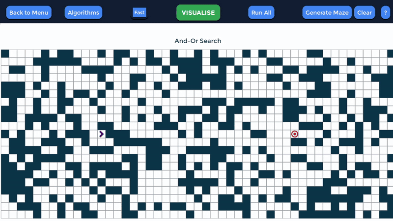

#### Giải pháp (Solution)
- **Định nghĩa:**
  - Giải pháp là đường đi từ trạng thái ban đầu (`grid.start`) đến trạng thái mục tiêu (`grid.end`), được biểu diễn dưới dạng:
    - Một danh sách các trạng thái trên lưới.
    - Các hành động tương ứng để di chuyển giữa các trạng thái.
    - Tổng chi phí (số bước di chuyển).
- **Kết quả:**
  - Nếu tìm được trạng thái mục tiêu:
    - Trả về danh sách các trạng thái, các hành động, và chi phí.
  - Nếu không tìm được trạng thái mục tiêu:
    - Trả về danh sách rỗng hoặc thông báo không tìm thấy giải pháp.

#### Nhận xét
- **AND-OR Search:**
  - Phù hợp cho các bài toán phức tạp với nhiều ràng buộc hoặc yêu cầu xử lý đồng thời nhiều trạng thái (nút AND).
  - Cần thiết kế bài toán hợp lý để đảm bảo hiệu quả và tối ưu trong xử lý.
  - Tốn tài nguyên để lưu trữ và xử lý cây trạng thái phức tạp.

### 2.5 Các thuật toán Tìm kiếm trong môi trường ràng buộc

#### Thành phần chính của bài toán tìm đường
1. **Trạng thái ban đầu (Initial State):**
   - Là vị trí xuất phát `grid.start`, được xác định trên lưới (grid). Vị trí này là điểm khởi đầu trong quá trình tìm đường.
2. **Trạng thái mục tiêu (Goal State):**
   - Là vị trí đích `grid.end`, được xác định trên lưới. Đây là trạng thái mà bài toán yêu cầu tìm đến.
3. **Không gian trạng thái (State Space):**
   - Bao gồm tất cả các trạng thái hợp lệ trên lưới, được tạo ra từ các hành động di chuyển từ trạng thái ban đầu đến trạng thái mục tiêu. Các trạng thái được kiểm tra thông qua ràng buộc (Constraint Satisfaction Problem - CSP).
4. **Tập hợp các hành động (Actions):**
   - Các hành động di chuyển trên lưới bao gồm:
     - Di chuyển lên.
     - Di chuyển xuống.
     - Di chuyển sang trái.
     - Di chuyển sang phải.
5. **Hàm chuyển đổi (Transition Function):**
   - Từ một ô hiện tại:
     - Lấy danh sách các hàng xóm thông qua hàm `grid.get_neighbors`.
     - Sắp xếp các hàng xóm theo một hàm heuristic, trong trường hợp này là **khoảng cách Manhattan** từ hàng xóm đến mục tiêu.
     - Thử di chuyển đến từng hàng xóm, kiểm tra ràng buộc (hàng xóm chưa được thăm) và gọi đệ quy để tiếp tục khám phá.
6. **Ràng buộc (Constraints):**
   - Một ô chỉ được thăm một lần trong đường đi hiện tại, nhằm tránh quay vòng hoặc đi lại các trạng thái đã xét.
7. **Hàm heuristic:**
   - **Khoảng cách Manhattan** được sử dụng để sắp xếp các ô hàng xóm trong quá trình lựa chọn hướng đi.
8. **Giới hạn bước (Max Steps):**
   - Giới hạn số bước di chuyển tối đa (`max_steps`) để tránh việc thuật toán chạy vô hạn.

#### Thuật toán và cách tiếp cận giải pháp
1. **Backtracking CSP:**
   - **Cách hoạt động:**
     - Sử dụng thuật toán đệ quy để thử tất cả các đường đi có thể từ trạng thái ban đầu đến trạng thái mục tiêu.
     - Tại mỗi bước:
       - Lấy danh sách các hàng xóm của ô hiện tại.
       - Sắp xếp hàng xóm theo giá trị heuristic.
       - Thử di chuyển đến từng hàng xóm và gọi đệ quy để khám phá tiếp.
       - Nếu không tìm được đường đi từ hàng xóm hiện tại, quay lui (backtrack) và thử các lựa chọn khác.
   - **Ưu điểm:**
     - Đơn giản và dễ triển khai.
     - Có khả năng tìm được giải pháp nếu tồn tại.
   - **Nhược điểm:**
     - Không đảm bảo tìm được giải pháp tối ưu.
     - Có thể tốn thời gian nếu không có giới hạn bước hoặc khi không gian trạng thái lớn.
   - **Kết quả trả về:**
     - Nếu tìm được giải pháp:
       - Trả về đường đi, danh sách trạng thái đã thăm (`explored_states`), và tổng chi phí.
     - Nếu không tìm được giải pháp:
       - Trả về danh sách rỗng hoặc thông báo không tìm thấy giải pháp.
    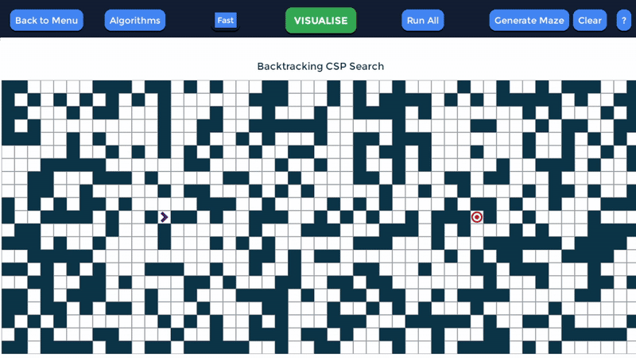

#### Giải pháp (Solution)
- **Định nghĩa:**
  - Giải pháp là đường đi từ trạng thái ban đầu (`grid.start`) đến trạng thái mục tiêu (`grid.end`), được biểu diễn dưới dạng:
    - Một danh sách các trạng thái trên lưới.
    - Các hành động tương ứng để di chuyển giữa các trạng thái.
    - Tổng chi phí (số bước di chuyển).
- **Kết quả:**
  - Nếu tìm được trạng thái mục tiêu:
    - Trả về danh sách các trạng thái, các hành động, và tổng chi phí.
  - Nếu không tìm được trạng thái mục tiêu:
    - Trả về danh sách rỗng hoặc thông báo không tìm thấy giải pháp.

#### Nhận xét
- **Backtracking CSP:**
  - Phù hợp cho các bài toán với không gian trạng thái nhỏ hoặc trung bình.
  - Hiệu quả khi có các ràng buộc rõ ràng để giảm không gian tìm kiếm.
  - Dễ mở rộng với các ràng buộc phức tạp hơn, nhưng không đảm bảo tối ưu nếu không có heuristic phù hợp.

### 2.6 Thuật toán Tìm kiếm học tăng cường

#### Thành phần chính của bài toán tìm đường
1. **Trạng thái ban đầu (Initial State):**
   - Là vị trí xuất phát `grid.start`, được xác định trên lưới. Đây là trạng thái khởi đầu mà thuật toán Q-Learning bắt đầu huấn luyện và tìm kiếm.
2. **Trạng thái mục tiêu (Goal State):**
   - Là vị trí đích `grid.end`, được xác định trên lưới. Đây là trạng thái mà thuật toán cần tìm đến.
3. **Không gian trạng thái (State Space):**
   - Bao gồm tất cả các trạng thái hợp lệ trên lưới, được tạo ra bởi các hành động di chuyển từ trạng thái ban đầu đến trạng thái mục tiêu.
4. **Tập hợp các hành động (Actions):**
   - Các hành động di chuyển trên lưới bao gồm:
     - Di chuyển lên.
     - Di chuyển xuống.
     - Di chuyển sang trái.
     - Di chuyển sang phải.
5. **Hàm chuyển đổi (Transition Function):**
   - Từ một trạng thái hiện tại:
     - Lấy danh sách các hàng xóm thông qua hàm `grid.get_neighbors`.
     - Lựa chọn hành động tiếp theo dựa trên chiến lược epsilon-greedy:
       - Với xác suất `epsilon`, chọn hành động ngẫu nhiên (khám phá).
       - Ngược lại, chọn hành động có giá trị Q cao nhất (khai thác).
6. **Hàm heuristic:**
   - **Khoảng cách Manhattan** được sử dụng để ước lượng khoảng cách còn lại giữa trạng thái hiện tại và trạng thái mục tiêu.
7. **Bảng Q (Q-Table):**
   - Là một bảng lưu trữ giá trị Q cho từng trạng thái và hành động, được khởi tạo với giá trị 0. Giá trị Q được cập nhật dựa trên:
     - **Hàm thưởng (Reward):** Điểm thưởng hoặc phạt tại mỗi bước.
     - **Tốc độ học (Learning Rate):** Tốc độ cập nhật giá trị Q.
     - **Hệ số chiết khấu (Discount Factor):** Tầm quan trọng của các phần thưởng trong tương lai.
8. **Chiến lược epsilon-greedy:**
   - Kết hợp giữa khám phá (exploration) và khai thác (exploitation):
     - Ban đầu, epsilon cao để khuyến khích khám phá.
     - Dần dần, epsilon giảm để tập trung vào khai thác các hành động tối ưu.
9. **Số tập huấn luyện (Episodes):**
   - Là số lần thuật toán thực hiện quá trình huấn luyện trên lưới để tối ưu hóa giá trị Q.

#### Thuật toán và cách tiếp cận giải pháp
1. **Q-Learning:**
   - **Cách hoạt động:**
     - Khởi tạo bảng Q với giá trị 0 cho tất cả các trạng thái và hành động.
     - Trong mỗi tập huấn luyện:
       - Bắt đầu từ trạng thái ban đầu.
       - Sử dụng chiến lược epsilon-greedy để chọn hành động.
       - Cập nhật giá trị Q dựa trên phần thưởng và giá trị Q trong tương lai.
       - Kết thúc tập huấn luyện khi đạt được trạng thái mục tiêu hoặc vượt quá số bước tối đa.
     - Sau khi huấn luyện, sử dụng bảng Q để tìm đường đi tốt nhất từ trạng thái ban đầu đến trạng thái mục tiêu.
   - **Ưu điểm:**
     - Có thể áp dụng cho các môi trường không biết trước.
     - Cải thiện dần qua các tập huấn luyện.
   - **Nhược điểm:**
     - Thời gian huấn luyện có thể dài nếu không gian trạng thái lớn.
     - Hiệu quả phụ thuộc vào tham số (learning rate, discount factor, epsilon).
   - **Kết quả trả về:**
     - Đường đi tốt nhất từ trạng thái ban đầu đến trạng thái mục tiêu, danh sách các trạng thái đã duyệt qua, và tổng chi phí.
    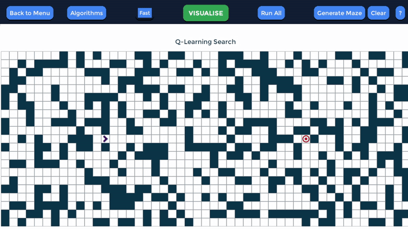

#### Giải pháp (Solution)
- **Định nghĩa:**
  - Giải pháp là đường đi từ trạng thái ban đầu (`tea`) đến trạng thái mục tiêu (`grid.end`), được biểu diễn dưới dạng:
    - Một danh sách các trạng thái trên lưới.
    - Các hành động tương ứng để di chuyển giữa các trạng thái.
    - Tổng chi phí (số bước di chuyển).
- **Kết quả:**
  - Nếu tìm được trạng thái mục tiêu:
    - Trả về danh sách các trạng thái, các hành động, và tổng chi phí.
  - Nếu không tìm được trạng thái mục tiêu:
    - Trả về danh sách rỗng hoặc thông báo không tìm thấy giải pháp.

#### Nhận xét
- **Q-Learning:**
  - Phù hợp cho các môi trường không biết trước hoặc thay đổi.
  - Hiệu quả trong việc tối ưu hóa hành vi qua các tập huấn luyện.
  - Đòi hỏi thời gian huấn luyện dài và cần tinh chỉnh các tham số để đạt hiệu quả cao.

### Bảng so sánh các thuật toán (mê cung được tạo bởi Randomised DFS)
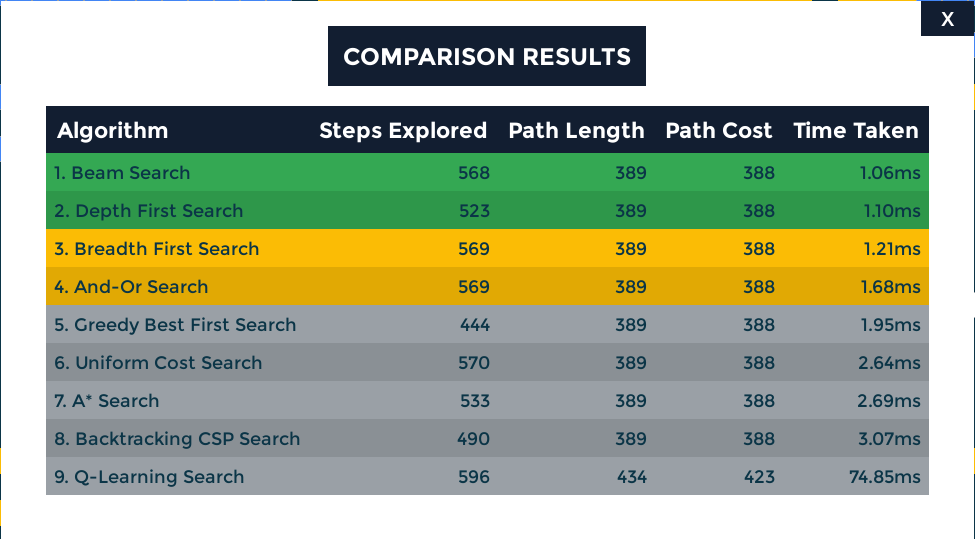

### 2.7 Nhóm thuật toán tạo maze/mê cung

#### Thành phần chính của bài toán tạo map
1. **Trạng thái ban đầu (Initial State):**
   - Là trạng thái ban đầu của lưới (maze), nơi các ô được thiết lập mặc định (trống hoặc đầy đủ tường).
   - Các điểm bắt đầu (`start`) và kết thúc (`goal`) được xác định trước.
2. **Trạng thái mục tiêu (Goal State):**
   - Là trạng thái cuối cùng của lưới, nơi các ô đã được tạo thành ma trận theo thuật toán tương ứng (có đường đi và tường).
3. **Không gian trạng thái (State Space):**
   - Bao gồm tất cả các trạng thái của lưới trong quá trình tạo, từ trạng thái ban đầu (tất cả ô trống hoặc tường) đến trạng thái mục tiêu (lưới hoàn chỉnh với đường đi).
4. **Tập hợp các hành động (Actions):**
   - Các hành động cụ thể được thực hiện tùy thuộc vào thuật toán:
     - **Thêm tường:** Đánh dấu ô là tường (`#`).
     - **Thêm đường đi:** Đánh dấu ô là đường đi (`1`).
     - **Phá tường:** Loại bỏ tường để tạo đường đi.
5. **Hàm chuyển đổi (Transition Function):**
   - Thay đổi trạng thái của các ô trong lưới dựa trên thuật toán tạo map.

#### Các thuật toán tạo map chính trong file `generate.py`
1. **Thuật toán `basic_weight_maze`:**
   - **Mục tiêu:** Tạo ma trận lưới với các ô được gán trọng số ngẫu nhiên.
   - **Cách hoạt động:**
     - Đi qua từng ô trong lưới.
     - Với xác suất nhất định (20%), gán giá trị trọng số (`value="9"`) cho ô đó.
   - **Ưu điểm:**
     - Đơn giản, nhanh chóng.
     - Hữu ích để tạo môi trường với các chi phí di chuyển khác nhau.
   - **Nhược điểm:**
     - Không tạo được lối đi rõ ràng.
   - **Kết quả:** Lưới với các ô trọng số ngẫu nhiên.
   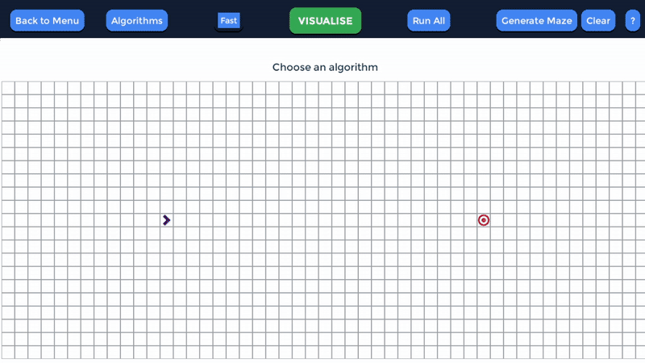
2. **Thuật toán `randomised_dfs`:**
   - **Mục tiêu:** Tạo mê cung bằng thuật toán tìm kiếm sâu ưu tiên ngẫu nhiên (Randomized DFS).
   - **Cách hoạt động:**
     - Bắt đầu từ điểm xuất phát.
     - Sử dụng ngăn xếp để lưu các ô cần duyệt.
     - Tại mỗi ô, chọn một hàng xóm chưa được thăm.
     - Phá tường giữa ô hiện tại và hàng xóm, sau đó thêm hàng xóm vào ngăn xếp.
   - **Ưu điểm:**
     - Tạo mê cung với một đường đi duy nhất từ điểm bắt đầu đến kết thúc.
     - Đơn giản và dễ triển khai.
   - **Nhược điểm:**
     - Tạo mê cung với độ phức tạp đều, không có nhiều ngã rẽ.
   - **Kết quả:** Mê cung với một đường đi duy nhất.
   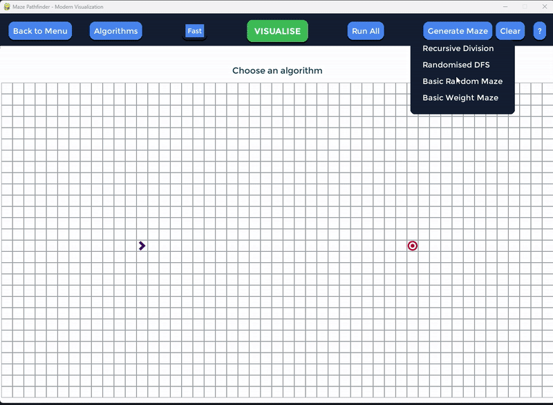
3. **Thuật toán `basic_random_maze`:**
   - **Mục tiêu:** Tạo mê cung ngẫu nhiên với mật độ tường được điều chỉnh.
   - **Cách hoạt động:**
     - Đi qua từng ô trong lưới.
     - Dựa trên giá trị mật độ (`wall_density`) được cấu hình, quyết định có thêm tường vào ô đó hay không.
     - Mật độ càng cao, càng nhiều ô được gán là tường.
   - **Ưu điểm:**
     - Dễ dàng tùy chỉnh độ phức tạp của mê cung thông qua mật độ tường.
     - Đơn giản và nhanh chóng.
   - **Nhược điểm:**
     - Không đảm bảo tạo một đường đi rõ ràng giữa điểm bắt đầu và kết thúc.
   - **Kết quả:** Lưới với tường ngẫu nhiên.
   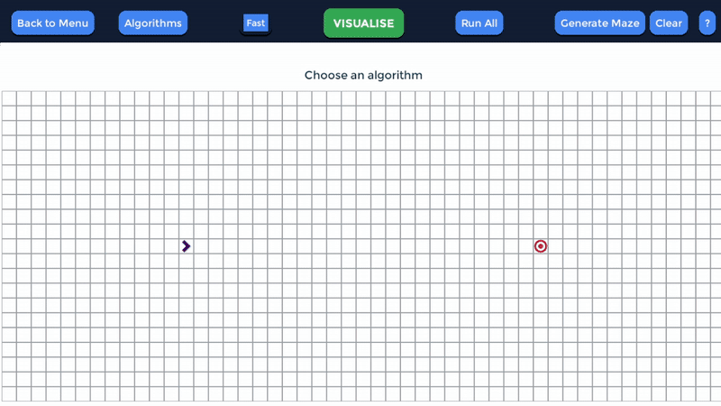
4. **Thuật toán `recursive_division`:**
   - **Mục tiêu:** Tạo mê cung bằng cách chia nhỏ lưới theo phương pháp đệ quy.
   - **Cách hoạt động:**
     - Chia lưới thành hai phần bằng cách vẽ một đường tường ngang hoặc dọc.
     - Tạo một lỗ trên đường tường (để làm lối đi).
     - Gọi đệ quy để chia tiếp các phần lưới con.
     - Kết thúc khi lưới con quá nhỏ để chia tiếp.
   - **Ưu điểm:**
     - Tạo mê cung có cấu trúc rõ ràng và phức tạp.
     - Đảm bảo có lối đi từ điểm bắt đầu đến kết thúc.
   - **Nhược điểm:**
     - Tốn thời gian hơn so với các thuật toán khác.
   - **Kết quả:** Mê cung có cấu trúc rõ ràng với lối đi được xác định.
   

#### Giải pháp (Solution)
- **Định nghĩa:**
  - Giải pháp là lưới hoàn chỉnh được tạo bởi một trong các thuật toán trên, với các ô được xác định là tường hoặc đường đi.
  - Kết quả bao gồm:
    - Ma trận lưới hoàn chỉnh.
    - Các thông tin cấu hình như mật độ tường, kích thước lưới.
- **Kết quả:**
  - Nếu thuật toán thực thi thành công:
    - Trả về lưới hoàn chỉnh.
  - Nếu không thực thi được (do lỗi hoặc giới hạn tài nguyên):
    - Trả về thông báo lỗi.

#### Nhận xét
- **`basic_weight_maze`:**
  - Phù hợp để tạo lưới có trọng số ngẫu nhiên, không yêu cầu lối đi cụ thể.
- **`randomised_dfs`:**
  - Tạo mê cung với một đường đi duy nhất, thích hợp cho các bài toán tìm đường.
- **`basic_random_maze`:**
  - Tạo mê cung ngẫu nhiên với độ phức tạp có thể kiểm soát.
- **`recursive_division`:**
  - Tạo mê cung phức tạp với cấu trúc rõ ràng, phù hợp cho các bài toán cần mê cung có chất lượng cao.

### 2.8 GAME MODE
**Game Mode** là một chế độ chính trong dự án, nơi người dùng tham gia vào trò chơi mê cung với các cấp độ khó khác nhau. Chế độ này không chỉ tạo ra trải nghiệm giải trí mà còn giúp người chơi hiểu rõ hơn về cách hoạt động của thuật toán tìm đường và khả năng ứng dụng thực tế.

#### 1. **Giao diện người dùng**
- **Thanh tiêu đề:** 
  - Hiển thị tên chế độ "Maze Game" và các nút điều khiển chính, bao gồm:
    - **Back to Menu:** Quay lại menu chính.
    - **Challenging Map:** Tạo một mê cung thử thách mới.
    - **Auto Solve:** Tự động giải mê cung.
- **Trình bày thông tin cấp độ:**
  - Hiển thị thông tin về cấp độ hiện tại, bao gồm:
    - **Tên cấp độ.**
    - **Thời gian còn lại** (nếu cấp độ có giới hạn thời gian).
  - Hiển thị hướng dẫn điều khiển: "Use WASD or Arrow Keys to move".

#### 2. **Các chức năng chính**
##### a. **Chơi giải mê cung:**
- Người chơi điều khiển nhân vật di chuyển trong mê cung bằng các phím **WASD** hoặc **phím mũi tên**.
- **Mục tiêu:** 
  - Tìm đường đến điểm đích (Goal) trước khi hết thời gian (nếu có giới hạn).
- **Hướng di chuyển:** 
  - Hệ thống hỗ trợ chỉ báo hướng nhân vật (phải, trái, lên, xuống) bằng cách xoay biểu tượng START.
- Level 1
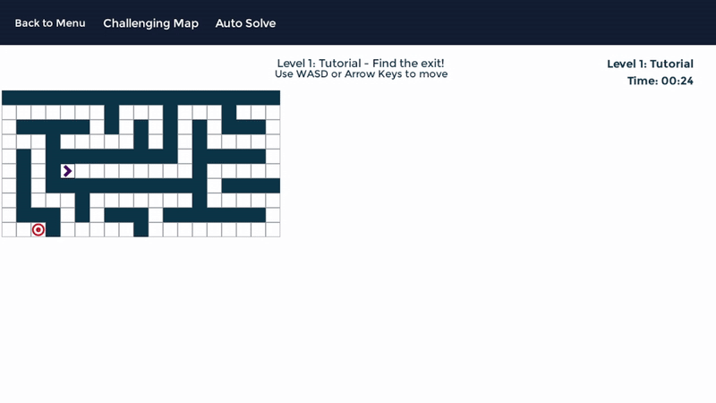
- Level 2
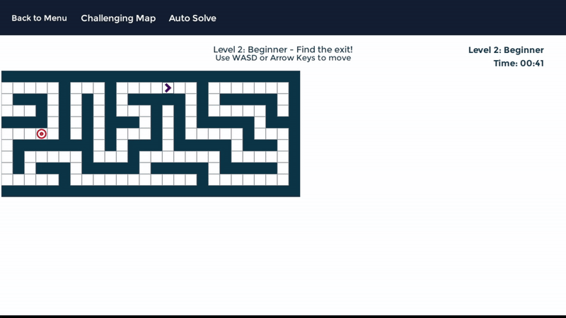
- Level 3
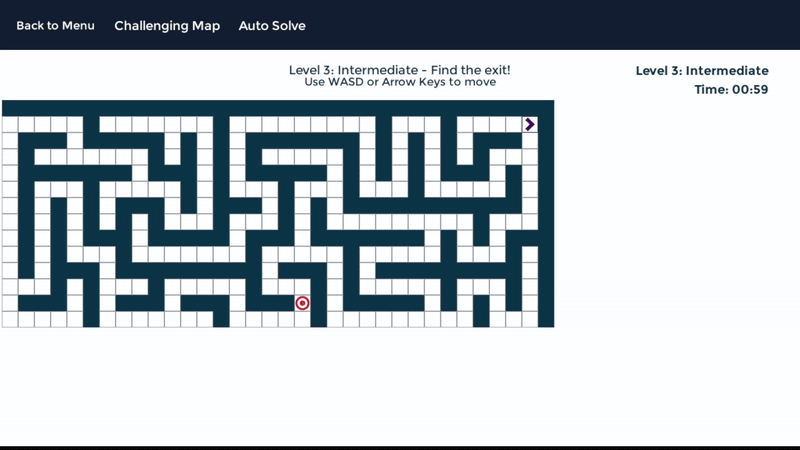
- Level 4
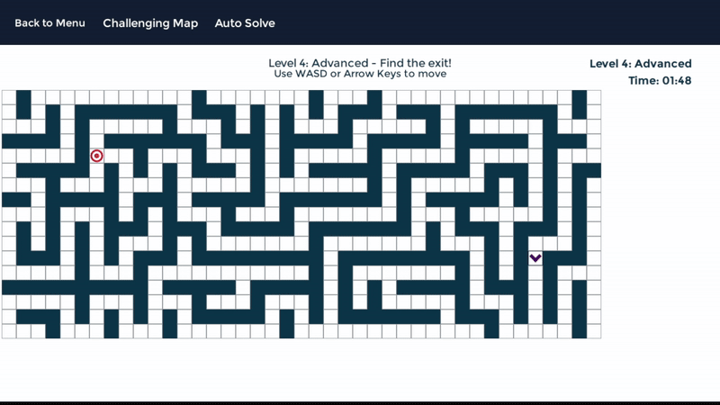
- Level 5
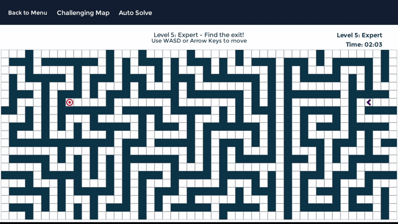

##### b. **Tạo mê cung thử thách (Challenging Map):**
- Người chơi có thể tạo một mê cung thử thách mới bằng cách nhấn nút **"Challenging Map"**.
- Hệ thống sẽ:
  - Đặt ngẫu nhiên vị trí bắt đầu (Start) và đích (Goal).
  - Sinh mê cung ngẫu hiên nhưng với nhiều đường cụt, lối đi "lừa" người chơi hơn 
  - Cập nhật mê cung và các thông tin liên quan.
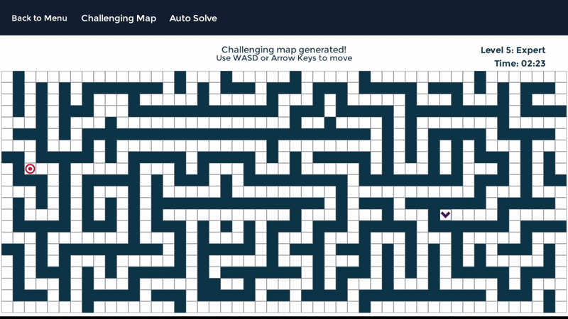

##### c. **Tự động giải mê cung (Auto Solve):**
- Khi người chơi nhấn nút **"Auto Solve"**, hệ thống sẽ:
  - Tự động tìm đường đi ngắn nhất từ điểm bắt đầu đến đích bằng thuật toán **Breadth First Search (BFS)**.
  - Hiển thị đường đi giải quyết trên mê cung bằng các ký hiệu đặc biệt.
  - Cung cấp hướng dẫn để người chơi theo dõi giải pháp.
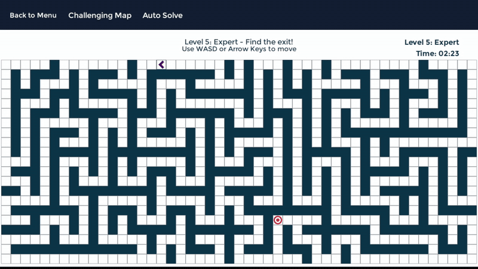

##### d. **Giới hạn thời gian:**
- Một số cấp độ có giới hạn thời gian, hiển thị đồng hồ đếm ngược.
- Nếu hết thời gian mà người chơi chưa hoàn thành, trò chơi sẽ hiển thị thông báo thua và cho phép chơi lại cấp độ.

##### e. **Hoàn thành cấp độ và mở khóa:**
- Khi người chơi đến đích:
  - Hệ thống đánh dấu cấp độ hiện tại là hoàn thành.
  - Mở khóa cấp độ tiếp theo (nếu có).
  - Hiển thị thông báo chúc mừng và cho phép tiếp tục sang cấp độ mới.

#### 3. **Quản lý cấp độ**
- Cấp độ được quản lý thông qua **LevelManager**, cung cấp các tính năng:
  - Tải dữ liệu cấp độ hiện tại: kích thước mê cung, giới hạn thời gian, độ khó.
  - Đánh dấu cấp độ đã hoàn thành.
  - Mở khóa các cấp độ tiếp theo.

#### 4. **Xử lý tình huống đặc biệt**
- **Người chơi thua cuộc:**
  - Nếu hết thời gian hoặc không thể tiếp tục, hệ thống hiển thị thông báo và cho phép chơi lại cấp độ.
- **Hoàn thành tất cả cấp độ:**
  - Khi người chơi hoàn thành cấp độ cuối cùng, hệ thống hiển thị thông báo chúc mừng và cho phép chơi lại từ cấp độ đầu tiên.

#### 5. **Trực quan hóa và trải nghiệm người dùng**
- Các tính năng trực quan hóa trong **Game Mode**:
  - Vẽ mê cung và các trạng thái (Start, Goal, đường đi, tường).
  - Hiển thị hướng dẫn di chuyển và trạng thái trò chơi trong thời gian thực.
- Giao diện được thiết kế hiện đại, trực quan, dễ sử dụng, mang lại trải nghiệm mượt mà cho người chơi.

## 3. Kết luận

Dự án Maze Explorer (VisualizeSearchAlgorithm) đã đạt được nhiều kết quả, cả về mặt kỹ thuật lẫn giá trị ứng dụng thực tế. Các kết quả này không chỉ phản ánh sự thành công trong việc hiện thực hóa ý tưởng ban đầu mà còn khẳng định vai trò của ứng dụng như một công cụ học tập và giải trí hữu ích trong lĩnh vực trí tuệ nhân tạo (AI). Dưới đây là một số kết quả nổi bật:

### 3.1 Trực quan hóa thành công các thuật toán tìm kiếm đường đi
- Dự án đã triển khai và trực quan hóa hiệu quả các thuật toán tìm kiếm như A*, BFS, DFS, và các thuật toán nâng cao khác như Greedy Best First Search, Beam Search, Q-Learning,... Người dùng có thể quan sát chi tiết cách mỗi thuật toán hoạt động, từ việc mở rộng các nút đến việc tìm ra đường đi tối ưu.
- Việc so sánh hiệu suất của các thuật toán (thời gian, độ dài đường đi) đã giúp người dùng hiểu rõ hơn về ưu và nhược điểm của từng thuật toán trong các trường hợp khác nhau.

### 3.2 Tích hợp và triển khai các thuật toán tạo mê cung đa dạng
- Dự án đã thành công trong việc tích hợp các thuật toán tạo mê cung như Recursive Division, Randomised DFS, Basic Random Maze, và Basic Weight Maze. Các thuật toán này không chỉ tạo ra các mê cung có cấu trúc đa dạng mà còn cung cấp các thử thách khác nhau cho người dùng.
- Mê cung được tạo ra có thể tùy chỉnh về mật độ tường, vị trí điểm xuất phát và điểm kết thúc, từ đó mang lại sự linh hoạt cao trong việc thiết kế các bài toán tìm đường.

### 3.3 Giao diện trực quan và trải nghiệm người dùng được tối ưu hóa
- Giao diện của ứng dụng được thiết kế hiện đại, dễ sử dụng, với các tính năng trực quan hóa mượt mà và tốc độ linh hoạt. Người dùng có thể dễ dàng tạo mê cung, chọn thuật toán, và quan sát kết quả trong thời gian thực.
- Chế độ trò chơi (Game Mode) mang lại trải nghiệm tương tác thú vị, giúp người dùng tự mình khám phá mê cung với các cấp độ khó tăng dần. Tính năng "Auto Solve" (tự động giải mê cung) cũng giúp người dùng quan sát cách hệ thống giải quyết các bài toán phức tạp.

### 3.4 Giá trị giáo dục và ứng dụng thực tế
- Thông qua việc trực quan hóa, dự án đã giúp người dùng, đặc biệt là sinh viên và người học về AI, hiểu rõ hơn về cách thức hoạt động của các thuật toán tìm kiếm và tạo mê cung. Đây là một công cụ học tập hữu ích, góp phần nâng cao nhận thức về ứng dụng của trí tuệ nhân tạo trong các bài toán thực tế.
- Mô hình này có thể mở rộng để áp dụng vào các lĩnh vực khác như lập kế hoạch robot, tối ưu hóa đường đi, và các hệ thống định tuyến.